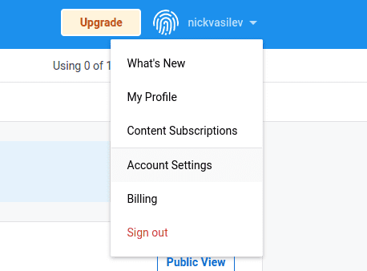
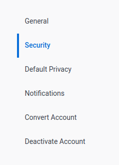
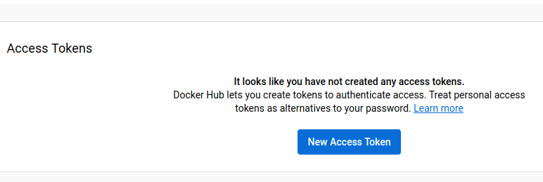
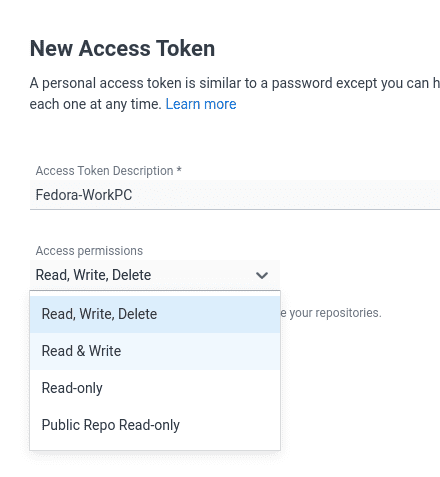
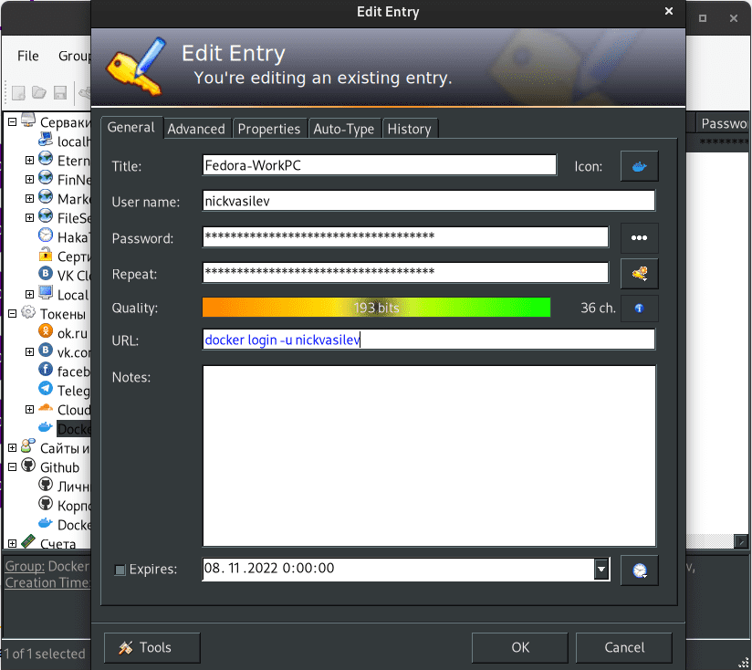

# Заливаем образ на Dockerhub

Заходим на [dockerhub](https://hub.docker.com/ "dockerhub"), регистрируем бесплатный аккаунт и верифицируем e-mail.

Затем переходим в настройки аккаунта:

Во вкладку "Безопасность":

Жмём генерировать новый токен:

Вводим название и даём права. Я даю права только на чтение и запись. Удаление репозитория в таком случае может производиться только непосредственно на сайте.

Далее сайт сгенерирует нам токен, который надо будет надёжно сохранить. Я использую [keepass](https://keepass.info/download.html "keepass") - универсальную программу для хранения баз паролей с удобной функцией автоввода, доступную на всех популярных платформах.

https://www.youtube.com/watch?v=ERvC8RAr4YQ