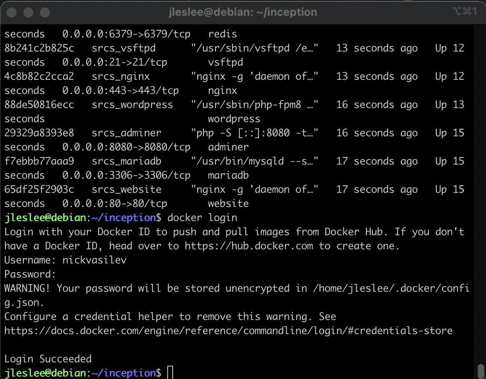
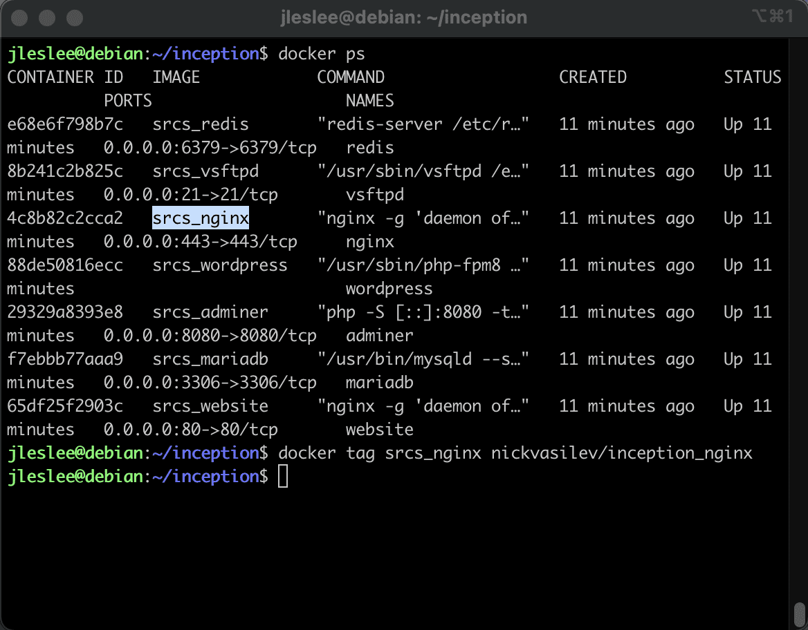
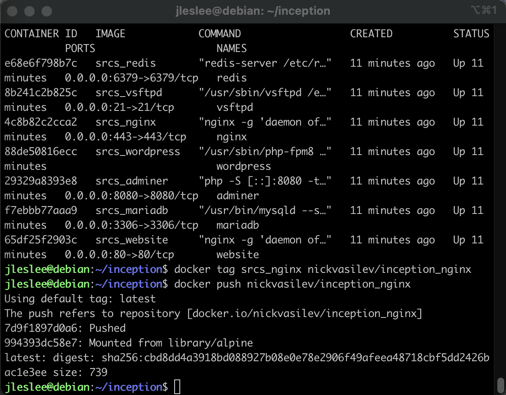
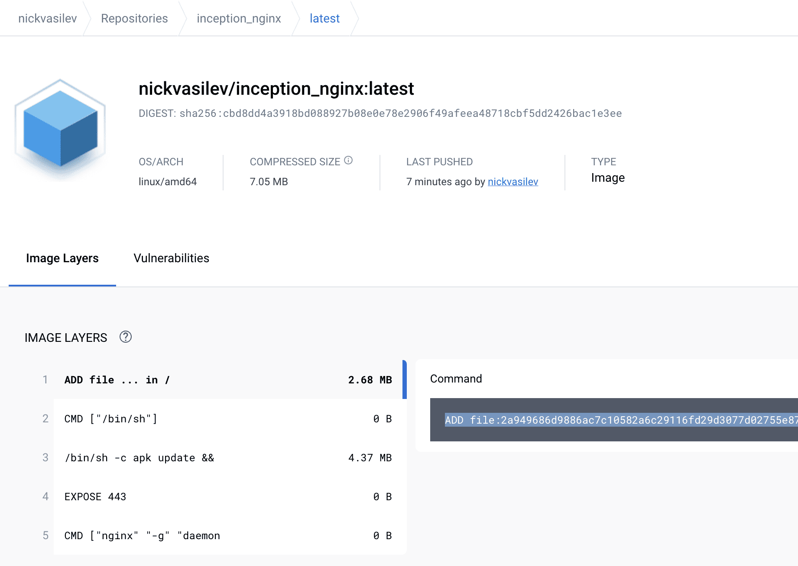

# Заливаем образ на Dockerhub

### Шаг 1. Создание аккаунта Dockerhub и получение токена

Заходим на [dockerhub](https://hub.docker.com/ "dockerhub"), регистрируем бесплатный аккаунт и верифицируем e-mail.

Затем переходим в настройки аккаунта:

Во вкладку "Безопасность":

Жмём генерировать новый токен:

Вводим название и даём права. Я даю права только на чтение и запись. Удаление репозитория в таком случае может производиться только непосредственно на сайте.

Далее сайт сгенерирует нам токен, который надо будет надёжно сохранить. Я использую [keepass](https://keepass.info/download.html "keepass") - универсальную программу для хранения баз паролей с удобной функцией автоввода, доступную на всех популярных платформах.

### Шаг 2. Заливка образа в Dockerhub

Теперь заходим в ОС, где делался проект [inception](https://github.com/codesshaman/inception "inception") и логинимся в системе при помощи команды

``docker login``

Нам предложат ввести логин и пароль, но в качестве пароля мы используем наш токен.

Теперь нам предстоит залить наши контейнеры dockerhub. Вводим ``docker ps`` и смотрим имеюшиеся контейнеры. Каждому из них нам предстоит назначить тег, или, грубо говоря, определить каждому контейнеру репозиторий в который тот будет загружен.

Начнём последовательно с nginx. Теги назначаются следующим образом:

``docker tag srcs_nginx nickvasilev/inception_nginx``

Естественно, вместо ``nickvasilev/inception_nginx`` должен быть указан путь к твоему репозиторию. Если имя контейнера у тебя отличается, его тоже следует указывать из твоего вывода ``docker-ps``.

Общий принцип прост. Сначала прописывается имя образа (srcs_nginx), а затем имя репозитория на dockerhub:

Теперь мы дали докеру понять, какой образ в какой репозиторий пушить, и можем приступить к самому процессу:

``docker push nickvasilev/inception_nginx``

И вуаля - наш образ загрузился в репозиторий!

