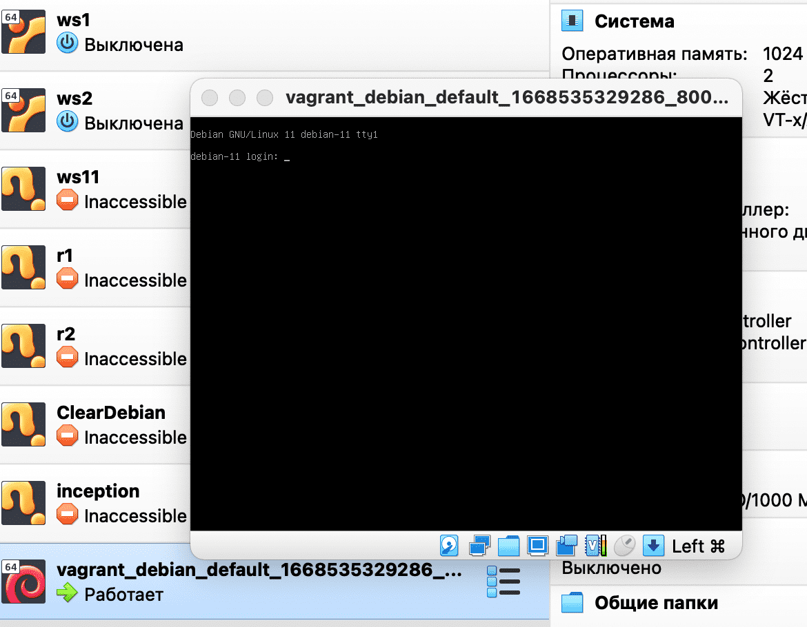

# Установка тестовой конфигурации vargrant

### Шаг 1. Установка vagrant

Заходим в managed software center и вбиваем в поиск "vagrant".

Устанавливаем найденное приложение.


Проверяем в терминале, что вагрант установился:

``vagrant -v``

Ответ (версия может отличаться):

```
Vagrant 2.2.19
```

Так же подготовим наш virtualbox - настроим сохранение конфигураций в goinfree:


Теперь мы готовы качать образы и устанавливать на их основе виртуальные машины!

### Шаг 2. Образ с vagrantup

Заходим на [vagrantup](https://app.vagrantup.com/boxes/search "vagrantup") и находим любимый дистрибутив операционной системы. Я выбрал Debian от bento (bento/debian-11). Заходим на страницу дистрибутива, копируем название образа из средней строчки Vagrantfile и скачиваем образ для virtualbox:


У нас скачался файл с длинным названием (в моём случае "a22d1053-8311-450b-a740-6e3017c087f8"). Я создам папку проетка в goinfree:

``cd ~/goinfre && mkdir vagrant_debian``

Перемещаю скачанный образ в эту (он скачался тоже в goinfre) папку и даю ему удобочитаемое имя:

``mv a22d1053-8311-450b-a740-6e3017c087f8 vagrant_debian/debian``

Теперь мы перейдём в эту папку и добавим наш бокс, вставив скопированное с сайта название:

``cd vagrant_debian && vagrant box add bento/debian-11 debian``

Затем инициируем vagrantfile:

``vagrant init -m bento/debian-11 debian``

Вагрант ответит нам следующим выводом:

```
A `Vagrantfile` has been placed in this directory. You are now
ready to `vagrant up` your first virtual environment! Please read
the comments in the Vagrantfile as well as documentation on
`vagrantup.com` for more information on using Vagrant.
```

Теперь нужно поднять конфигурацию командой

``vagrant up --provider=virtualbox``

Как мы можем увидеть, в качестве флага можно задать имя желаемого провайдера (нашей системы виртуализации).

В результате vagrant скажет, что всё получилось:


А в virtualbox-e появится наша конфигурация:



Тестовый запуск состоялся! Теперь можно выключать машину и настраивать Vagrantfile.