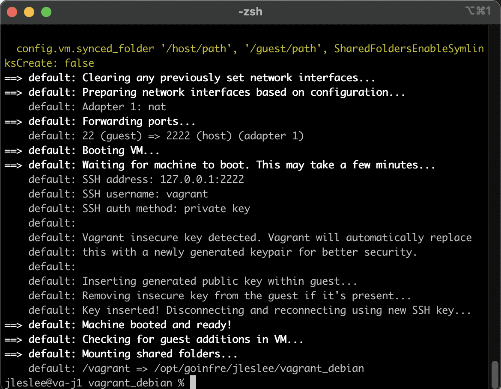
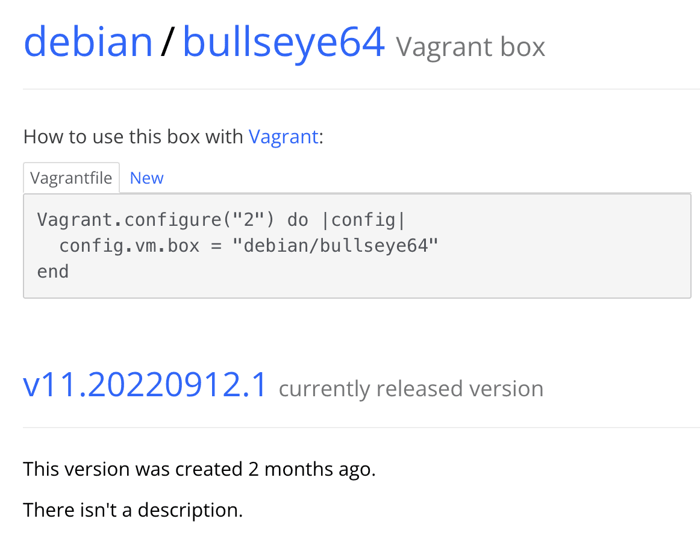

# Установка vargrant и написание Vagrantfile

### Шаг 1. Установка vagrant

Заходим в managed software center и вбиваем в поиск "vagrant".

Устанавливаем найденное приложение.


Проверяем в терминале, что вагрант установился:

``vagrant -v``

Ответ (версия может отличаться):

```
Vagrant 2.2.19
```

### Шаг 2. Создание Vagrantfile

Теперь нам нужно написать наш Vagrantfile, который будет поднимать нужные нам контейнеры. Я создам в домашней директории папку Vagrant и в ней буду работать с этим файлом:

``mkdir ~/Vagrant && cd ~/Vagrant``

Теперь нам нужно инициализировать vagrant в этой директории:

``vagrant init``

И мы обнаружим, что Vagrantfile лежит в нашем каталоге:



### Шаг 3. Образ с vagrantup

Теперь рассмотрим, из каких элементов состоит Vagrantfile. Сначала я открыл его в VSCode и удалил все лишние комментарии. Потом я вставил туда свои комментарии с упрощённм описанием блоков, из которых состоит Vagrantfile (После строки Vagrant.configure):

```

  # Создание виртуальной машины

  # Конфигурация сети

  # Синхронизация папок

  # Настройки провайдеров

  # Дополнительные скрипты

```

Каждый из этих блоков должен описать последовательно определённый этап сборки и конфигурации виртуальной машины.

Начнём с первого из них - создания виртуальной машины.

Заходим на [vagrantup](https://app.vagrantup.com/boxes/ "vagrantup") и находим любимый дистрибутив операционной системы. Я выбрал Debian от bentoo. Заходим на страницу дистрибутива и видим, как внедрить его в наш Vagrantfile:



Копирую строчку конфигурации и вставляю в свой Vagrantfile. Так как я разворачиваю мастер-ноду, я назову бокс "Master". Теперь Vagrantfile выглядит следующим образом:

```
# -*- mode: ruby -*-
# vi: set ft=ruby :
Vagrant.configure("2") do |config|
  # Создание виртуальной машины
  master.vm.box = "debian/bullseye64"
  
  # Конфигурация сети
  
  # Синхронизация папок
  
  # Настройки провайдеров

  # Дополнительные скрипты

end

```

При создании машины Vagrant попытается вытянуть Vagrantfile из образа. Но у нас в приоритете настройки, котрые мы пропишем сами в нашем vagrantfile, потому попробуем отключить эту опцию.

``master.vm.ignore_box_vagrantfile = true``

Теперь vagrant будет читать только наш текущий Vagrantfile.


### Шаг 4. Конфигурация сети и папок

Переходим к следующему пункту. Для нашей машины укажем способ подключения, и это будет ssh:

``master.vm.communicator = "ssh"``

Зададим машине имя хоста:

``master.vm.hostname = "master"``

Настроем машине сеть, используя частные адреса, задав IP принудительно через переменную:

``master.vm.network "private_network", ip: MASTER_NODE_IP``

Пробросим нужные порты в гостевую систему:

```
master.vm.network "forwarded_port", guest: 80, host: 80
master.vm.network "forwarded_port", guest: 42, host: 42
master.vm.network "forwarded_port", guest: 443, host: 443
```

Теперь в разделе "Синхронизация папок" укажем единственный нужный нам параметр:

``master.vm.synced folder ".", "/vagrant", disabled: true``

Этот параметр отменяет какое-либо монтирование внешних папок в наш образ.

### Шаг 5. Работа с провайдерами

В терминологии vagrant провайдеры - это просто разные типы виртуалок. Так как мы используем virtualbox, подробный api этого провайдера мы можем найти [на этой странице](https://www.virtualbox.org/manual/ch08.html "VBoxManage")