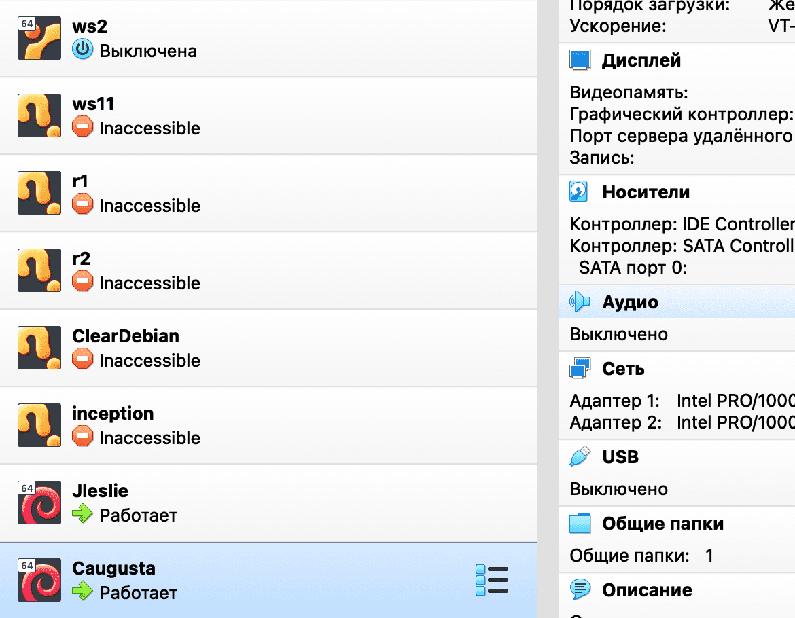

# Установка vargrant и написание Vagrantfile

### Шаг 1. Установка vagrant

Заходим в managed software center и вбиваем в поиск "vagrant".

Устанавливаем найденное приложение.


Проверяем в терминале, что вагрант установился:

``vagrant -v``

Ответ (версия может отличаться):

```
Vagrant 2.2.19
```

Так же подготовим наш virtualbox - настроим сохранение конфигураций в goinfree:


Теперь мы готовы качать образы и устанавливать на их основе виртуальные машины!

### Шаг 2. Образ с vagrantup

Заходим на [vagrantup](https://app.vagrantup.com/boxes/search "vagrantup") и находим любимый дистрибутив операционной системы. Я выбрал Debian от bentoo. Заходим на страницу дистрибутива, копируем название образа из средней строчки Vagrantfile и скачиваем образ для virtualbox:


У нас скачался файл с длинным названием (в моём случае "a22d1053-8311-450b-a740-6e3017c087f8"). Я создам папку проетка в goinfree:

``cd ~/goinfre && mkdir vagrant_debian``

Перемещаю скачанный образ в эту (он скачался тоже в goinfre) папку и даю ему удобочитаемое имя:

``mv a22d1053-8311-450b-a740-6e3017c087f8 vagrant_debian/debian``

Теперь мы перейдём в эту папку и добавим наш бокс, вставив скопированное с сайта название:

``cd vagrant_debian && vagrant box add bento/debian-11 debian``

Затем инициируем vagrantfile:

``vagrant init -m bento/debian-11 debian``

Вагрант ответит нам следующим выводом:

```
A `Vagrantfile` has been placed in this directory. You are now
ready to `vagrant up` your first virtual environment! Please read
the comments in the Vagrantfile as well as documentation on
`vagrantup.com` for more information on using Vagrant.
```

Теперь нужно поднять конфигурацию командой

``vagrant up --provider=virtualbox``

Как мы можем увидеть, в качестве флага можно задать имя желаемого провайдера (нашей системы виртуализации).

В результате vagrant скажет, что всё получилось:


А в virtualbox-e появится наша конфигурация:


Тестовый запуск состоялся! Теперь можно выключать машину и настраивать Vagrantfile.

### Шаг 3. Конфигурация переменных

Откроем на редактирование наш Vagrantfile:

nano Vagrantfile

И увидим, что в нём уже есть некоторая конфигурация:

```
# -*- mode: ruby -*-
# vi: set ft=ruby :

Vagrant.configure("2") do |config|
  config.vm.box = "bento/debian-11"
  config.vm.box_url = "debian"
end
```

Vagrant написан на go, и потому его конфигурационные файлы мы тоже будем писать на этом языке. Вставим прямо после шапки

```
# -*- mode: ruby -*-
# vi: set ft=ruby :
```

Следующий код, который задаёт переменные для всех необходимых нам параметров:

```
# master config
MASTER_NODE_NAME = 'Jleslie'
MASTER_NODE_HOSTNAME = 'Server'
MASTER_NODE_IP = '192.168.56.110'

# worker config
WORKER_NODE_NAME = 'Caugusta'
WORKER_NODE_HOSTNAME = 'ServerWorker'
WORKER_NODE_IP = '192.168.56.111'

# machines config
MEM = 512
CPU = 1
```

Здесь ``MASTER_NODE_NAME`` - ник одного из участников команды, ``WORKER_NODE_NAME`` - ник другого участника (если работа не в команде, можно придумать иные обозначения).

``MASTER_NODE_HOSTNAME = 'Server'`` и ``WORKER_NODE_HOSTNAME = 'ServerWorker'`` заданы по сабжу именно так, айпи адреса тоже прописаны жёстко какие должны быть по сабжу.

Размер памяти - от 512 до 1024, так же выделяем 1 - 2 ядра на выбор. Можно задать обеим машинам одинаковые параметры а можно задать мастер ноде вдвое больше ресурсов, чем рабочей ноде.

### Шаг 4. Конфигурация образа

Настроим образ, из которого будем разворачивать машину. Для этого слегка дополним те параметры, которые уже были в файле когда мы его открыли.

Здесь мы сообщаем вагранту, что будем разворачивать конфигурации из нашего образа с заданными параметрами cpu и памяти:

```
# create machines config
Vagrant.configure("2") do |config|
	config.vm.box = "bento/debian-11"
  config.vm.box_url = "debian"
	config.vm.provider "virtualbox" do |v|
		v.memory = MEM
		v.cpus = CPU
	end
```

В терминологии vagrant провайдеры - это просто разные типы виртуалок. Так как мы используем virtualbox, прописываем в провайдеры его.

### Шаг 5. Добавляем машины

Теперь пропишем две машины, которые будем поднимать:

```
  # master node config
	config.vm.define MASTER_NODE_NAME do |master|
		master.vm.hostname = MASTER_NODE_HOSTNAME
		master.vm.network :private_network, ip: MASTER_NODE_IP
		master.vm.provider "virtualbox" do |v|
			v.name = MASTER_NODE_NAME
		end
	end

  # worker node config
	config.vm.define WORKER_NODE_NAME do |worker|
		worker.vm.hostname = WORKER_NODE_HOSTNAME
		worker.vm.network :private_network, ip: WORKER_NODE_IP 	
		worker.vm.provider "virtualbox" do |v|
			v.name = WORKER_NODE_NAME 
		end
	end
end
```

Здесь мы задаём им приватную сеть с установленными вручную статическими ip из нашего гайда. И конечно же задаём имя каждой машине.

Таким образом весь наш Vagrantfile выглядит примерно так:

```
# -*- mode: ruby -*-
# vi: set ft=ruby :

# master config
MASTER_NODE_NAME = 'Jleslie'
MASTER_NODE_HOSTNAME = 'Server'
MASTER_NODE_IP = '192.168.56.110'

# worker config
WORKER_NODE_NAME = 'Caugusta'
WORKER_NODE_HOSTNAME = 'ServerWorker'
WORKER_NODE_IP = '192.168.56.111'

# machines config
MEM = 512
CPU = 1

# create machines config
Vagrant.configure("2") do |config|
	config.vm.box = "bento/debian-11"
	config.vm.provider "virtualbox" do |v|
		v.memory = MEM
		v.cpus = CPU
	end

  # master node config
	config.vm.define MASTER_NODE_NAME do |master|
		master.vm.hostname = MASTER_NODE_HOSTNAME
		master.vm.network :private_network, ip: MASTER_NODE_IP
		master.vm.provider "virtualbox" do |v|
			v.name = MASTER_NODE_NAME
		end
	end

  # worker node config
	config.vm.define WORKER_NODE_NAME do |worker|
		worker.vm.hostname = WORKER_NODE_HOSTNAME
		worker.vm.network :private_network, ip: WORKER_NODE_IP 	
		worker.vm.provider "virtualbox" do |v|
			v.name = WORKER_NODE_NAME 
		end
	end
end
```

### Шаг 6. Пересобираем проект с новым Vagrantfile

Теперь удалим нашу машину и соберём конфигурацию заново. Сначала выключим работающую виртуалку, созданную vagrant-ом, затем удалим конфигурацию вместе со всеми файлами. Для этого выполним команду:

``cd ~/goinfre/vagrant_debian && vagrant destroy``

Соберём нашу конфигурацию из нового Vagrantfile:

``vagrant up --provider=virtualbox``

На этом этапе в virtualbox должны появиться две нужные нам машины:



Отлично, наши машины работают. Продолжим их настройку.
