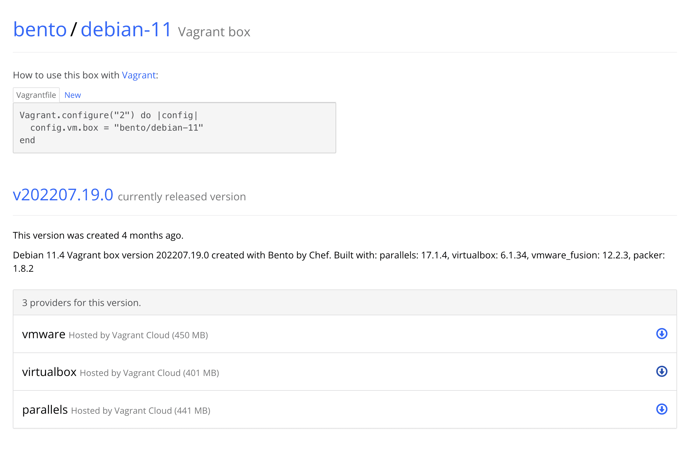

# Установка vargrant и написание Vagrantfile

### Шаг 1. Установка vagrant

Заходим в managed software center и вбиваем в поиск "vagrant".

Устанавливаем найденное приложение.


Проверяем в терминале, что вагрант установился:

``vagrant -v``

Ответ (версия может отличаться):

```
Vagrant 2.2.19
```

Так же подготовим наш virtualbox - настроим сохранение конфигураций в goinfree:


Теперь мы готовы качать образы и устанавливать на их основе виртуальные машины!

### Шаг 2. Образ с vagrantup

Заходим на [vagrantup](https://app.vagrantup.com/boxes/search "vagrantup") и находим любимый дистрибутив операционной системы. Я выбрал Debian от bentoo. Заходим на страницу дистрибутива, копируем название образа из средней строчки Vagrantfile и скачиваем образ для virtualbox:



У нас скачался файл с длинным названием (в моём случае "a22d1053-8311-450b-a740-6e3017c087f8"). Я создам папку проетка в goinfree:

``cd ~/goingree && mkdir vagrant_debian``

Перемещаю скачанный образ в эту (он скачался тоже в goinfre) папку и даю ему удобочитаемое имя:

``mv a22d1053-8311-450b-a740-6e3017c087f8 vagrant_debian/debian``

Теперь мы перейдём в эту папку и добавим наш бокс, вставив скопированное с сайта название:

``cd vagrant_debian && vagrant box add bento/debian-11 debian``

Затем инициируем vagrantfile:

``vagrant init -m bento/debian-11 debian``

Вагрант ответит нам следующим выводом:

```
A `Vagrantfile` has been placed in this directory. You are now
ready to `vagrant up` your first virtual environment! Please read
the comments in the Vagrantfile as well as documentation on
`vagrantup.com` for more information on using Vagrant.
```

Теперь нужно поднять конфигурацию командой

``vagrant up --provider=virtualbox``

Как мы можем увидеть, в качестве флага можно задать имя желаемого провайдера (нашей системы виртуализации).

В результате vagrant скажет, что всё получилось:


А в virtualbox-e появится наша конфигурация:


Тестовый запуск состоялся! Теперь можно выключать машину и настраивать Vagrantfile.

### Шаг 3. Конфигурация Vagrantfile

Теперь рассмотрим, из каких элементов состоит Vagrantfile. Сначала я открыл его в VSCode и удалил все лишние комментарии. Потом я вставил туда свои комментарии с упрощённм описанием блоков, из которых состоит Vagrantfile (После строки Vagrant.configure):

```

  # Создание виртуальной машины

  # Конфигурация сети

  # Синхронизация папок

  # Настройки провайдеров

  # Дополнительные скрипты

```

Каждый из этих блоков должен описать последовательно определённый этап сборки и конфигурации виртуальной машины.

Начнём с первого из них - создания виртуальной машины.

```
# -*- mode: ruby -*-
# vi: set ft=ruby :
Vagrant.configure("2") do |config|
  # Создание виртуальной машины
  master.vm.box = "debian/bullseye64"
  
  # Конфигурация сети
  
  # Синхронизация папок
  
  # Настройки провайдеров

  # Дополнительные скрипты

end

```

При создании машины Vagrant попытается вытянуть Vagrantfile из образа. Но у нас в приоритете настройки, котрые мы пропишем сами в нашем vagrantfile, потому попробуем отключить эту опцию.

``master.vm.ignore_box_vagrantfile = true``

Теперь vagrant будет читать только наш текущий Vagrantfile.


### Шаг 4. Конфигурация сети и папок

Переходим к следующему пункту. Для нашей машины укажем способ подключения, и это будет ssh:

``master.vm.communicator = "ssh"``

Зададим машине имя хоста:

``master.vm.hostname = "master"``

Настроем машине сеть, используя частные адреса, задав IP принудительно через переменную:

``master.vm.network "private_network", ip: MASTER_NODE_IP``

Пробросим нужные порты в гостевую систему:

```
master.vm.network "forwarded_port", guest: 80, host: 80
master.vm.network "forwarded_port", guest: 42, host: 42
master.vm.network "forwarded_port", guest: 443, host: 443
```

Теперь в разделе "Синхронизация папок" укажем единственный нужный нам параметр:

``master.vm.synced folder ".", "/vagrant", disabled: true``

Этот параметр отменяет какое-либо монтирование внешних папок в наш образ.

### Шаг 5. Работа с провайдерами

В терминологии vagrant провайдеры - это просто разные типы виртуалок. Так как мы используем virtualbox, подробный api этого провайдера мы можем найти [на этой странице](https://www.virtualbox.org/manual/ch08.html "VBoxManage")