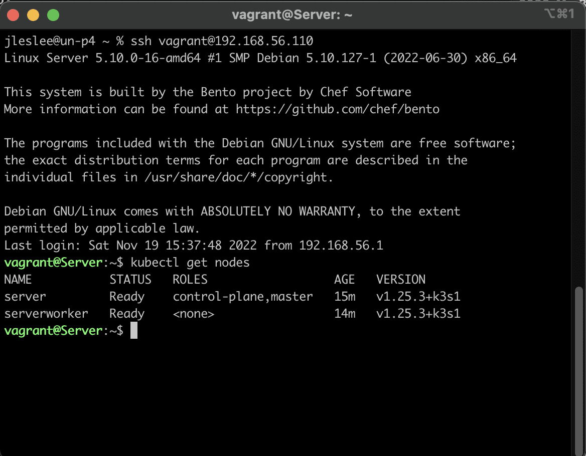

# Установка K3s и вход по ключу

### Шаг 1. Вход по ключу

По заданию нам нужно настроить виртуалки так, чтобы при входе они не запрашивали пароля. Это можно сделать при помощи ssh-ключей. 

SSH-ключ это пара из закрытого и открытого ключа. Сгенерировать их можно командой ``ssh-keygen``, указав имя выходного файла. На unix-системах они сохраняются в директории ``~/.ssh``, если не указывать имя выходного файла он будет сохранён как ``~/.ssh/id_rsa``, а публичный ключ - ``~/.ssh/id_rsa.pub``.

На школьных машинах уже имеются сгенерированные ключи для репозиториев. Используем их и для подключения к нашим виртуалкам. Для этого пропишем в Vagrantfile диективу

```
        id_rsa_pub = File.read("#{Dir.home}/.ssh/id_rsa.pub")
  		config.vm.provision "copy ssh public key", type: "shell",
    inline: "echo \"#{id_rsa_pub}\" >> /home/vagrant/.ssh/authorized_keys"
```

после строк

```
        v.memory = MEM
		v.cpus = CPU
```

Первой строкой мы считываем наш публичный ключ, второй копируем его в виртуальную машину и третьей записываем в конечный файл с ключами.

Теперь мы можем входить по ключу не вспоминая про пароли.

### Шаг 2. Запуск K3s на мастер-ноде

Для запуска нашего кубера воспользуемся стандартной инструкцией из официального гайда. Наша мастер нода должна установиться и сгенерировать токен, по которому к ней будут подключаться рабочие ноды. Запишем все необходимые действия в скрипт:

``mkdir scripts``

``nano scripts/master_node_setup.sh``

Скрипт включает в себя следующее:

```
#!/bin/bash

# add k3s in env
export INSTALL_K3S_EXEC="--write-kubeconfig-mode=644 --tls-san $(hostname) --node-ip $1  --bind-address=$1 --advertise-address=$1 "

# download and run k3s agent
curl -sfL https://get.k3s.io |  sh -

# copy master node token for worker node
sudo cp /var/lib/rancher/k3s/server/node-token /mnt/scripts/
```

Добавляем в переменную окружения переданные ноде переменные с IP, загружаем кубер и копируем сгенерированный масер-нодой токен в папку /mnt/scripts/, которую мы позже примонтируем в виртуалку директивой в Vagrantfile.

### Шаг 3. Запуск K3s на рабочей ноде

Создадим в папке scripts файл worker_node_setup.sh

``nano scripts/worker_node_setup.sh``

Со следующим кодом:

```
#!/bin/bash

# add k3s master node token
export TOKEN_FILE="/mnt/scripts/node-token"

# add k3s master node ip and worker node ip
export INSTALL_K3S_EXEC="agent --server https://$1:6443 --token-file $TOKEN_FILE --node-ip=$2"

# download and run k3s agent
curl -sfL https://get.k3s.io | sh -
```

Рабочая нода сначала экспортирует токен, сгенерированный масер-нодой, затем установит переменные окружения с адресами обеих нод и запустит K3s с данными параметрами.

Итого в каталоге vagrant_debian у нас лежат два скрипта в папке scripts и один Vagrantfile в корне.

Дополним Vagrantfile чтобы конфигурация работала.

### Шаг 4. Работа с Vagrantfile

Добавим мастеру после строки

``master.vm.network :private_network, ip: MASTER_NODE_IP``

следующие строки:

```
		# configure shared folder
		master.vm.synced_folder ".", "/mnt", type: "virtualbox"
		# run script for master node with argument
		master.vm.provision "shell", privileged: true, path: "scripts/master_node_setup.sh", args: [MASTER_NODE_IP]
```

Здесь мы монтируем директорию, в которой находимся, в файловую систему, передаём виртуалке наш скрипт и передаём наш IP в качестве аргумента.

В том же месте мы передаём рабочей ноде следующее:

```
        worker.vm.synced_folder ".", "/mnt", type: "virtualbox"
		# run script for worker node with arguments
		worker.vm.provision "shell", privileged: true, path: "scripts/worker_node_setup.sh", args: [MASTER_NODE_IP, WORKER_NODE_IP]
```

Здесь мы, как можно догадаться по скрипту, передаём оба IP-адреса.

Итого получается такой вот Vagrantfile:

```
# -*- mode: ruby -*-
# vi: set ft=ruby :

# master config
MASTER_NODE_NAME = 'Jleslie'
MASTER_NODE_HOSTNAME = 'Server'
MASTER_NODE_IP = '192.168.56.110'

# worker config
WORKER_NODE_NAME = 'Caugusta'
WORKER_NODE_HOSTNAME = 'ServerWorker'
WORKER_NODE_IP = '192.168.56.111'

# machines config
MEM = 1024
CPU = 1

# create machines config
Vagrant.configure("2") do |config|
	config.vm.box = "bento/debian-11"
	config.vm.provider "virtualbox" do |v|
		v.memory = MEM
		v.cpus = CPU
		# for connect with SSH on both machines with no password
		id_rsa_pub = File.read("#{Dir.home}/.ssh/id_rsa.pub")
  		config.vm.provision "copy ssh public key", type: "shell",
    	  inline: "echo \"#{id_rsa_pub}\" >> /home/vagrant/.ssh/authorized_keys"
	end

  # master node config
	config.vm.define MASTER_NODE_NAME do |master|
		master.vm.hostname = MASTER_NODE_HOSTNAME
		master.vm.network :private_network, ip: MASTER_NODE_IP
		# configure shared folder
		master.vm.synced_folder ".", "/mnt", type: "virtualbox"
		# run script for master node with argument
		master.vm.provision "shell", privileged: true, path: "scripts/master_node_setup.sh", args: [MASTER_NODE_IP]
		master.vm.provider "virtualbox" do |v|
			v.name = MASTER_NODE_NAME
		end
	end

  # worker node config
	config.vm.define WORKER_NODE_NAME do |worker|
		worker.vm.hostname = WORKER_NODE_HOSTNAME
		worker.vm.network :private_network, ip: WORKER_NODE_IP
		# configure shared folder
		worker.vm.synced_folder ".", "/mnt", type: "virtualbox"
		# run script for worker node with arguments
		worker.vm.provision "shell", privileged: true, path: "scripts/worker_node_setup.sh", args: [MASTER_NODE_IP, WORKER_NODE_IP]
		worker.vm.provider "virtualbox" do |v|
			v.name = WORKER_NODE_NAME 
		end
	end
end
```

### Шаг 5: Перезапуск и проверка

Соберём нашу конфигурацию из нового Vagrantfile:

``vagrant up --provider=virtualbox``

Когда конфигурация поднимется, подключаемся по ssh сначала к мастер-ноде:

``ssh vagrant@192.168.56.110``

И посмотрим на наши ноды:

``kubectl get nodes``



